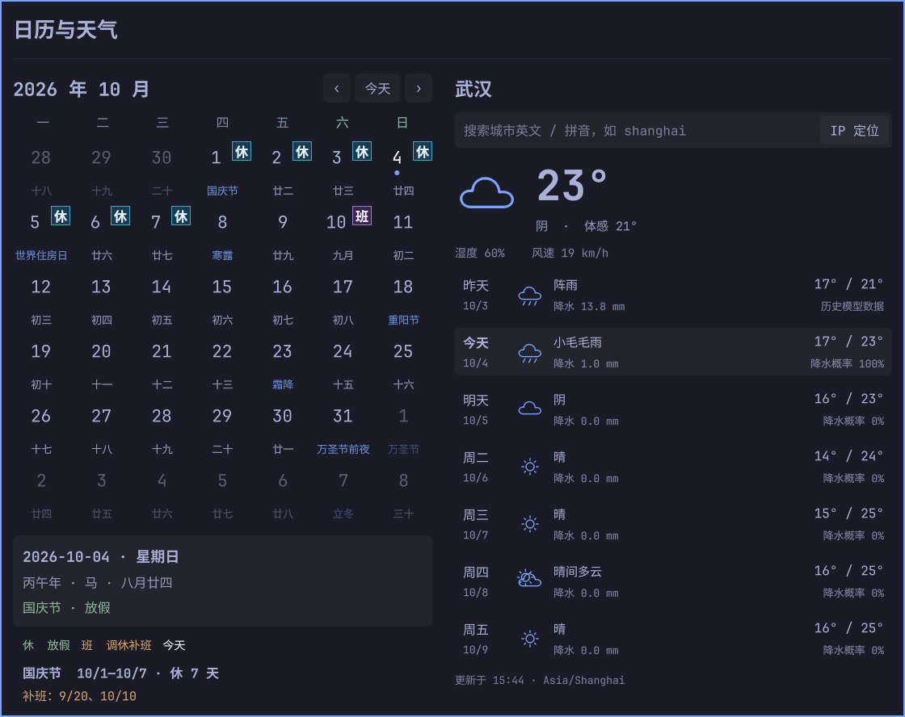

# Omarchy Days · 日历与天气

原生 Omarchy / Quickshell 插件。启用后在任务栏的托盘区域显示日历图标，点击打开左侧日历、右侧天气的面板。兼容水平、垂直状态栏以及 `andy.side-panel`，跟随 Omarchy 主题。



## 功能

- 公历月历、中国农历、闰月、传统节日与节气；切换月份，点击查看某一天。
- 中国大陆官方放假与调休补班标记；展示完整假期和跨月补班日期。
- 默认按公网 IP 定位城市；可用中文、英文、拼音或拼音前缀搜索手动切换。
- 搜索支持大小写、空格和别名，例如 `shang`、`shang hai`、`Beijing`、`Peking`、`xi'an`。
- 本地提供 2,336 个城市／城镇索引，优先离线搜索；其他地点使用在线搜索。
- 候选项显示省份／地区，区分同名和同拼音城市。
- 七天天气严格为昨天、今天、未来五天；显示天气、最低／最高温、降水量、降水概率和今日体感、湿度、风速。
- 手动选择保存在 `shell.json` 的插件条目中，重启后保留，可切回 IP 定位。
- 状态栏图标右键循环切换：日历、天气图标＋温度、星期与时间、年月日与时间、农历、假日倒数；选择持久化，见「扩展状态栏内容」。
- 异步请求、搜索防抖、15 分钟天气缓存、断网提示与旧缓存回退。

## 安装

需要支持插件的 Omarchy Shell、Quickshell、Python 3.10+ 和网络（首次安装依赖、天气与 IP 定位）。

克隆项目并安装：

```bash
git clone https://github.com/manateelazycat/omarchy-days.git
cd omarchy-days
bash install.sh
```

安装脚本将插件复制到 `${XDG_CONFIG_HOME:-~/.config}/omarchy/plugins/andy.days/`，把农历依赖安装到 `${XDG_DATA_HOME:-~/.local/share}/omarchy-days/venv/`，等待 Shell 完成扫描后启用图标。已有托盘组件时，将日历图标放在其旁边；在 `andy.side-panel` 中显示于左侧侧栏，隐藏时移动鼠标到屏幕左边缘展开。重复运行可更新本地安装；不会覆盖 Git 管理的安装目录。依赖环境放在插件目录外，符合 Omarchy 禁止插件内部符号链接的规则。

如果通过 `omarchy plugin add https://github.com/manateelazycat/omarchy-days --yes` 安装，请在安装目录中先运行 `bash bootstrap.sh`，再运行 `omarchy plugin enable andy.days --section right`。Omarchy 的 Git 安装器不会执行插件的安装脚本。

搭配 `andy.side-panel` 时，请使用支持保留插件自身弹窗样式的侧栏版本；旧版的统一弹窗样式会覆盖日历字号、字色和角标形状。日历通过 `preservePopupAppearance` 声明保留自身样式。

```bash
omarchy plugin disable andy.days
omarchy plugin remove andy.days --yes
```

卸载插件不会删除共享依赖环境和天气缓存，需要时可自行清理。

## 操作

- 点击状态栏日历图标：打开／关闭面板；点击面板外或按 `Esc` 关闭。
- 右键状态栏图标：循环切换显示内容，依次为 日历 → 天气图标＋温度 → 星期与时间 → 年月日与时间 → 农历 → 假日倒数（假期中显示剩余天数，平时显示距下一个假日天数），选择保存在 `shell.json` 中，重启后保持；也可用 `omarchy-shell andy.days cycleIconMode` 或 `setIconMode <模式>` 切换。
- `‹` / `›` 或左右方向键：切换月份；“今天”或 `Home` 返回今天。
- 按 `/` 聚焦城市搜索；输入至少两个字符；上下键选候选项，`Enter` 确认。
- 清空搜索或搜索框内按 `Esc` 返回天气；“IP 定位”恢复自动定位。
- 图标中键强制更新天气。

也可以从终端调用：

```bash
omarchy-shell andy.days toggle
omarchy-shell andy.days refresh
```

天气围绕所选城市的当地“今天”展示，翻阅日历不会改变天气日期范围。中国大陆使用北京时间，其他城市使用地点时区。

## 数据与限制

农历和节气由 [lunar-python](https://github.com/6tail/lunar-python) 本地计算，日历可离线使用，界面支持 1901–2099 年。

放假调休数据来自 [holiday-cn](https://github.com/NateScarlet/holiday-cn)，其中记录了国务院公告原文链接。附带 2024–2026 年快照；浏览其他年份时会尝试下载对应数据，每天最多检查一次。未收录年份明确提示，农历节日不会自动冒充官方放假。假期数据仅用于中国大陆。

天气来自 [Open-Meteo](https://open-meteo.com/en/docs)。昨天使用该接口的近期历史模型数据，当前天气同样基于天气模型，并非气象站实测值。温度单位为摄氏度，风速为 km/h；缺失数据用 `—` 显示。免费公开接口适用于非商业使用；商业用途请遵守服务条款或换用商业接口。

城市索引由 [GeoNames](https://www.geonames.org/) `cities15000` 数据筛选生成（中国大陆、香港、澳门、台湾），是有规模的城市和城镇集合，不能保证覆盖所有乡镇。索引未匹配时由 [Open-Meteo Geocoding](https://open-meteo.com/en/docs/geocoding-api) 在线补充全球地点。IP 定位使用 [IPWhois](https://ipwhois.io/documentation)；自动定位可能受代理和 VPN 影响。手动模式不调用 IP 定位服务。

天气、搜索、IP 及年度假期缓存保存在 `${XDG_CACHE_HOME:-~/.cache}/omarchy-days/`。切换城市时清除旧面板数据，网络失败不会显示其他城市的天气。旧天气缓存最多回退 48 小时，缓存日期跨天时重新按当前日期排列，缺少的日期显示 `—`。

## 扩展状态栏内容

状态栏展示是一个独立模块，新增显示模式不需要改动持久化、右键循环或尺寸逻辑。相关文件分工：

| 文件 | 职责 |
| ---- | ---- |
| `BarWidget.qml` | 编排层：读取／持久化 `iconMode` 设置、右键循环、按钮槽位尺寸、IPC |
| `BarContent.qml` | 内容模块：`modes` 模式注册表 + 每种模式的渲染器，自己测量隐式尺寸 |
| `TodayModel.qml` | 今日数据（农历、假日倒数）的异步进程封装，对应 `backend.py today` |
| `WeatherBarIcon.qml` | 「天气图标＋温度」复合渲染项示例 |
| `DaysModel.qml` | 面板数据（月历、天气、搜索），天气模式复用其 `weatherData` |

### 新增一个文本模式

以「农历」为例，只需改 `BarContent.qml` 两处：

1. 在 `modes` 列表注册：`{ id: "lunar", label: "农历" }`（`label` 用于悬停提示）；
2. 在 `textFor()` 增加分支：`if (id === "lunar") return todayData ? todayData.lunar : "—"`，并把 `id` 加进 `isTextMode` 数组。

模块会自动测量文字宽度并让按钮槽位变宽，竖向状态栏中文字自动旋转。

### 新增一个图标／复合模式

以「天气」为例：

1. 写一个渲染项（参考 `WeatherBarIcon.qml`），根元素暴露 `implicitWidth`／`implicitHeight`，横竖栏各自给出沿栏方向的尺寸；
2. 在 `BarContent.qml` 实例化它：`visible: root.mode === "xxx"`，锚定 `anchors.centerIn: parent`，超出 16px 图标画布的内容会自然外溢居中显示（不要开启 `clip`）；
3. 把它的尺寸纳入 `contentExtent` 的计算分支。

### 新增数据源

需要异步计算的数据走「`backend.py` 子命令 + QML 模型」的组合，绝不在 UI 线程做网络或重计算：

1. `backend.py` 增加一个函数与子命令，返回 `{"ok": true, ...}`（参考 `today_info()`，农历与假日倒数均在本地离线计算）；
2. 仿照 `TodayModel.qml` 新建模型：`Process` + `StdioCollector` 调用 `python3 backend.py <命令>`，解析失败与退出码都按错误处理；
3. 在 `BarWidget.qml` 实例化模型并绑定给 `BarContent` 的属性，同时在该模型的 `active` 条件中列出依赖它的模式，避免其他模式下空转拉取数据；
4. 需要跨天刷新的模型参考 `TodayModel.qml` 里的 `SystemClock` 日期守卫。

### 免费获得的行为

- **持久化**：`iconMode` 随右键选择写入 `shell.json` 插件条目，重启后保持；出现未注册的值时回退显示日历图标，循环切换会自动跳回第一个模式。
- **右键循环**：`BarWidget.qml` 遍历 `modes` 生成顺序，无需为新模式改动。
- **IPC**：`cycleIconMode` 与 `setIconMode <模式>` 对新模式立即生效。
- **多屏**：每个状态栏实例各自渲染，数据模型与持久化由 `persist()` 统一处理。

## 开发与验证

```bash
bash bootstrap.sh
python3 -m unittest discover -s tests -v
omarchy plugin validate .
python3 backend.py month --year 2026 --month 10
python3 backend.py today
python3 backend.py search --query 'shang hai' --offline
```

使用 `python3 scripts/update_data.py` 从上游重新生成离线城市索引和节假日快照。插件入口是 `BarWidget.qml`，布局在 `DaysPanel.qml`，异步进程管理在 `DaysModel.qml`，数据处理在 `backend.py`。

`bash scripts/preview.sh` 可在独立 Quickshell 实例中预览，不修改现有状态栏配置。按 `Ctrl+C` 退出。预览自带模拟的状态栏设置接口，城市选择只保存在该实例中。

## 许可与署名

Copyright (C) 2026 Andy Stewart。

项目代码使用 **GNU General Public License v3.0（GPL-3.0-only）**，完整协议见 [LICENSE](LICENSE)。

节假日数据保留上游 MIT 许可，见 [licenses/holiday-cn-MIT.txt](licenses/holiday-cn-MIT.txt)。修改后的 GeoNames 城市索引按 [CC BY 4.0](https://creativecommons.org/licenses/by/4.0/) 使用并署名 GeoNames，见 [licenses/geonames-notice.txt](licenses/geonames-notice.txt)；天气数据署名 Open-Meteo。农历依赖使用上游 MIT 许可。
